# ORCHID – Organ Retrieval & Collection of Health Information for Donation Dataset – SQL Data Analysis

## 1. ETL - Create a trigger for automatically updating the donor_type column with values 'DBD','DCD' or 'Unknown'

### Reasoning
The donor_type value is derived from existing clinical fields - brain death status and asystole timing. Rather than recomputing this logic in every query, a trigger automatically updates the donor_type value.

### Optimization
Using a trigger ensures donor_type is always kept in sync with  fields brain_death and time_asystole even when the data chnages.

### SQL Query
```sql
-- 1. Add donor_type column if it doesn't exist
ALTER TABLE referrals 
ADD COLUMN IF NOT EXISTS donor_type text;

---------------------------------------------------------
-- 2. Create trigger function to set donor_type
---------------------------------------------------------
CREATE OR REPLACE FUNCTION set_donor_type()
RETURNS trigger AS $$
BEGIN
    IF NEW.brain_death = TRUE THEN
        NEW.donor_type := 'DBD';

    ELSIF NEW.time_asystole IS NOT NULL THEN
        NEW.donor_type := 'DCD';

    ELSE
        NEW.donor_type := 'Unknown';
    END IF;

    RETURN NEW;
END;
$$ LANGUAGE plpgsql;

---------------------------------------------------------
-- 3. Create trigger (fires BEFORE UPDATE)
---------------------------------------------------------
CREATE OR REPLACE TRIGGER donor_type_trigger
BEFORE UPDATE ON referrals
FOR EACH ROW 
EXECUTE FUNCTION set_donor_type();

---------------------------------------------------------
-- 4. Force trigger to run on all existing rows
--    (this is REQUIRED to populate donor_type)
---------------------------------------------------------
UPDATE referrals
SET donor_type = donor_type;

---------------------------------------------------------
-- 5. Verify results
---------------------------------------------------------
SELECT donor_type, COUNT(*) 
FROM referrals
GROUP BY donor_type;

```
### Results
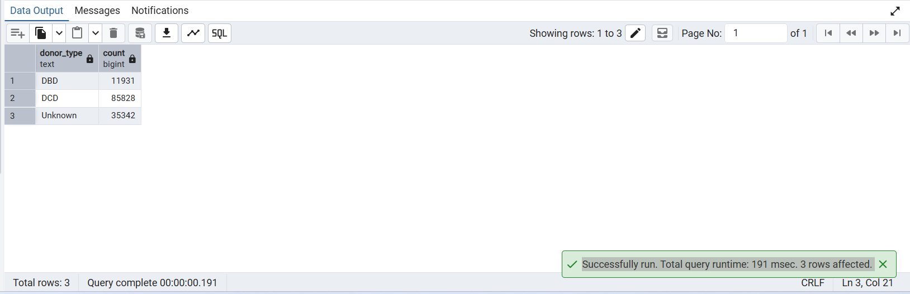

## 2. ETL - Computing Organ Recovery and Transplantation Fields

### Reasoning
Fields like total_recovered_organs, total_transplanted_organs are frequently used across many queries, so computing them once during ETL avoids repeating the same CASE logic in every analysis and improves query performance.

### Optimization
The stored procedure keeps all the organ‑counting and flag‑setting logic in one place.

### SQL Query
``` sql

    ALTER TABLE referrals ADD COLUMN IF NOT EXISTS age_group text;
    ALTER TABLE referrals ADD COLUMN IF NOT EXISTS total_recovered_organs int;
    ALTER TABLE referrals ADD COLUMN IF NOT EXISTS total_transplanted_organs int;
    ALTER TABLE referrals ADD COLUMN IF NOT EXISTS total_discarded_organs int;
    ALTER TABLE referrals ADD COLUMN IF NOT EXISTS is_recovered_any boolean;
    ALTER TABLE referrals ADD COLUMN IF NOT EXISTS is_transplanted_any boolean;


CREATE OR REPLACE PROCEDURE compute_etl_fields()
LANGUAGE plpgsql
AS $$
BEGIN
    UPDATE referrals
    SET
        age_group = CASE
            WHEN age < 18 THEN 'Under 18'
            WHEN age BETWEEN 18 AND 45 THEN '18–45'
            WHEN age BETWEEN 46 AND 60 THEN '46–60'
            WHEN age BETWEEN 61 AND 74 THEN '61–74'
            ELSE '75+'
        END,

        total_recovered_organs =
            (CASE WHEN outcome_heart IN ('Transplanted','Recovered for Transplant but not Transplanted') THEN 1 ELSE 0 END) +
            (CASE WHEN outcome_liver IN ('Transplanted','Recovered for Transplant but not Transplanted') THEN 1 ELSE 0 END) +
            (CASE WHEN outcome_kidney_left IN ('Transplanted','Recovered for Transplant but not Transplanted') THEN 1 ELSE 0 END) +
            (CASE WHEN outcome_kidney_right IN ('Transplanted','Recovered for Transplant but not Transplanted') THEN 1 ELSE 0 END) +
            (CASE WHEN outcome_lung_left IN ('Transplanted','Recovered for Transplant but not Transplanted') THEN 1 ELSE 0 END) +
            (CASE WHEN outcome_lung_right IN ('Transplanted','Recovered for Transplant but not Transplanted') THEN 1 ELSE 0 END) +
            (CASE WHEN outcome_intestine IN ('Transplanted','Recovered for Transplant but not Transplanted') THEN 1 ELSE 0 END) +
            (CASE WHEN outcome_pancreas IN ('Transplanted','Recovered for Transplant but not Transplanted') THEN 1 ELSE 0 END),

        total_transplanted_organs =
            (CASE WHEN outcome_heart = 'Transplanted' THEN 1 ELSE 0 END) +
            (CASE WHEN outcome_liver = 'Transplanted' THEN 1 ELSE 0 END) +
            (CASE WHEN outcome_kidney_left = 'Transplanted' THEN 1 ELSE 0 END) +
            (CASE WHEN outcome_kidney_right = 'Transplanted' THEN 1 ELSE 0 END) +
            (CASE WHEN outcome_lung_left = 'Transplanted' THEN 1 ELSE 0 END) +
            (CASE WHEN outcome_lung_right = 'Transplanted' THEN 1 ELSE 0 END) +
            (CASE WHEN outcome_intestine = 'Transplanted' THEN 1 ELSE 0 END) +
            (CASE WHEN outcome_pancreas = 'Transplanted' THEN 1 ELSE 0 END),

        total_discarded_organs =
            (
                (CASE WHEN outcome_heart IN ('Transplanted','Recovered for Transplant but not Transplanted') THEN 1 ELSE 0 END) +
                (CASE WHEN outcome_liver IN ('Transplanted','Recovered for Transplant but not Transplanted') THEN 1 ELSE 0 END) +
                (CASE WHEN outcome_kidney_left IN ('Transplanted','Recovered for Transplant but not Transplanted') THEN 1 ELSE 0 END) +
                (CASE WHEN outcome_kidney_right IN ('Transplanted','Recovered for Transplant but not Transplanted') THEN 1 ELSE 0 END) +
                (CASE WHEN outcome_lung_left IN ('Transplanted','Recovered for Transplant but not Transplanted') THEN 1 ELSE 0 END) +
                (CASE WHEN outcome_lung_right IN ('Transplanted','Recovered for Transplant but not Transplanted') THEN 1 ELSE 0 END) +
                (CASE WHEN outcome_intestine IN ('Transplanted','Recovered for Transplant but not Transplanted') THEN 1 ELSE 0 END) +
                (CASE WHEN outcome_pancreas IN ('Transplanted','Recovered for Transplant but not Transplanted') THEN 1 ELSE 0 END)
            )
            -
            (
                (CASE WHEN outcome_heart = 'Transplanted' THEN 1 ELSE 0 END) +
                (CASE WHEN outcome_liver = 'Transplanted' THEN 1 ELSE 0 END) +
                (CASE WHEN outcome_kidney_left = 'Transplanted' THEN 1 ELSE 0 END) +
                (CASE WHEN outcome_kidney_right = 'Transplanted' THEN 1 ELSE 0 END) +
                (CASE WHEN outcome_lung_left = 'Transplanted' THEN 1 ELSE 0 END) +
                (CASE WHEN outcome_lung_right = 'Transplanted' THEN 1 ELSE 0 END) +
                (CASE WHEN outcome_intestine = 'Transplanted' THEN 1 ELSE 0 END) +
                (CASE WHEN outcome_pancreas = 'Transplanted' THEN 1 ELSE 0 END)
            ),

        is_recovered_any = (
            outcome_heart IN ('Transplanted','Recovered for Transplant but not Transplanted') OR
            outcome_liver IN ('Transplanted','Recovered for Transplant but not Transplanted') OR
            outcome_kidney_left IN ('Transplanted','Recovered for Transplant but not Transplanted') OR
            outcome_kidney_right IN ('Transplanted','Recovered for Transplant but not Transplanted') OR
            outcome_lung_left IN ('Transplanted','Recovered for Transplant but not Transplanted') OR
            outcome_lung_right IN ('Transplanted','Recovered for Transplant but not Transplanted') OR
            outcome_intestine IN ('Transplanted','Recovered for Transplant but not Transplanted') OR
            outcome_pancreas IN ('Transplanted','Recovered for Transplant but not Transplanted')
        ),

        is_transplanted_any = (
            outcome_heart = 'Transplanted' OR
            outcome_liver = 'Transplanted' OR
            outcome_kidney_left = 'Transplanted' OR
            outcome_kidney_right = 'Transplanted' OR
            outcome_lung_left = 'Transplanted' OR
            outcome_lung_right = 'Transplanted' OR
            outcome_intestine = 'Transplanted' OR
            outcome_pancreas = 'Transplanted'
        );

END;
$$;

CALL compute_etl_fields();

SELECT
    AGE_GROUP,
    TOTAL_RECOVERED_ORGANS,
    TOTAL_TRANSPLANTED_ORGANS,
    TOTAL_DISCARDED_ORGANS,
    IS_RECOVERED_ANY,
    IS_TRANSPLANTED_ANY
FROM
    referrals;

```

### Results
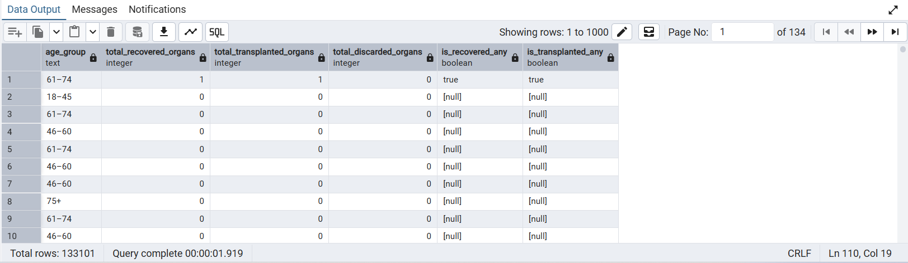

## 3. ETL - Data cleaning in abo_rh

### Reasoning
The abo_rh field has data quality issues (e.g., "Negative " vs "Negative"), which cause logically identical values to be treated as distinct in GROUP BY queries. To ensure accurate aggregation, we standardize this field by trimming whitespace so that each blood type/Rh combination is represented by a single, clean value.

### Optimization
If we don’t fix the data at the source, every query must use TRIM(abo_rh). By fixing the source itself, we eliminate code duplication and guarantee consistent results.

### SQL Query
``` sql
UPDATE referrals SET abo_rh = TRIM(abo_rh);

SELECT abo_rh From referrals
GROUP BY abo_rh;
```

### Results
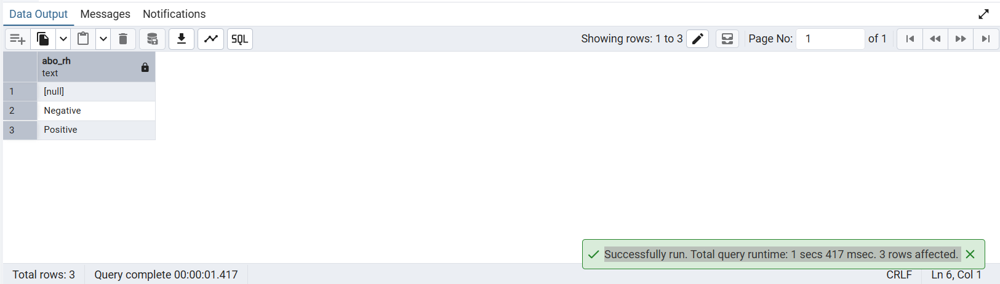

## 4. ETL -Data cleaning in mechanism_of_death and circumstances_of_death fields

### Reasoning
The mechanism_of_death  and circumstances of death fields contain inconsistent values—such as spelling variations, punctuation differences etc. which cause logically identical categories to appear as separate groups in analysis. Standardizing these values ensures accurate aggregation and prevents duplicate categories.

### Optimization
By fixing the field at the source using UPDATE statement, we ensure consistent categorization and eliminate repeated cleanup code across all queries.

#### a. Mechanism of death
##### SQL Query
```sql
UPDATE referrals
SET mechanism_of_death =
    CASE

        /* --- Asphyxiation --- */
        WHEN mechanism_of_death ILIKE '%asphyx%' 
            THEN 'Asphyxiation'

        /* --- Blunt Injury --- */
        WHEN mechanism_of_death ILIKE '%blunt%' 
            THEN 'Blunt Injury'

        /* --- Cardiovascular --- */
        WHEN mechanism_of_death ILIKE '%cardio%' 
            THEN 'Cardiovascular'

        /* --- Drowning --- */
        WHEN mechanism_of_death ILIKE '%drown%' 
            THEN 'Drowning'

        /* --- Drug Intoxication --- */
        WHEN mechanism_of_death ILIKE '%drug%' 
         AND mechanism_of_death ILIKE '%intox%' 
            THEN 'Drug Intoxication'

        /* --- Electrical --- */
        WHEN mechanism_of_death ILIKE '%electr%' 
            THEN 'Electrical'

        /* --- Gunshot variants --- */
        WHEN mechanism_of_death ILIKE '%gun%' 
            THEN 'Gunshot'

        /* --- Stroke / ICH variants --- */
        WHEN mechanism_of_death ILIKE '%ich%' 
          OR mechanism_of_death ILIKE '%stroke%' 
          OR mechanism_of_death ILIKE '%hemm%' 
          OR mechanism_of_death ILIKE '%hemorr%' 
            THEN 'Stroke / ICH'

        /* --- Natural Causes --- */
        WHEN mechanism_of_death ILIKE '%natural%' 
            THEN 'Natural Causes'

        /* --- None of the Above --- */
        WHEN mechanism_of_death ILIKE '%none of the above%' 
            THEN 'None of the Above'

        /* --- Seizure --- */
        WHEN mechanism_of_death ILIKE '%seiz%' 
            THEN 'Seizure'

        /* --- Stabbing --- */
        WHEN mechanism_of_death ILIKE '%stab%' 
            THEN 'Stabbing'

        /* --- Sudden Infant Death --- */
        WHEN mechanism_of_death ILIKE '%infant%' 
         AND mechanism_of_death ILIKE '%death%' 
            THEN 'Sudden Infant Death'

        /* --- Other --- */
        WHEN mechanism_of_death ILIKE '%other%' 
            THEN 'Other'

        /* --- Default cleanup: trim + normalize case --- */
        ELSE INITCAP(TRIM(mechanism_of_death))

    END;

select mechanism_of_death from referrals
group by mechanism_of_death;

```
##### Results
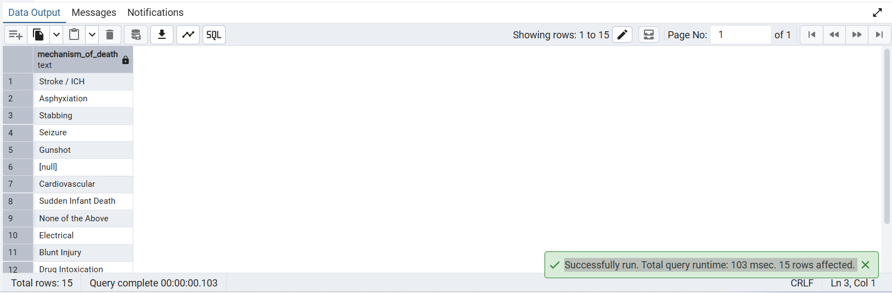

#### b. Circumstances of death
##### SQL Query
```sql
UPDATE referrals
SET circumstances_of_death =
    CASE

        /* --- Motor Vehicle Accident (MVA) --- */
        WHEN circumstances_of_death ILIKE '%mva%' 
          OR circumstances_of_death ILIKE '%motor vehicle%' 
            THEN 'Motor Vehicle Accident'

        /* --- Non-Motor Vehicle Accident --- */
        WHEN circumstances_of_death ILIKE '%non-motor%' 
          OR circumstances_of_death ILIKE '%non mva%' 
          OR circumstances_of_death ILIKE '%accident%' 
         AND circumstances_of_death ILIKE '%non%' 
            THEN 'Non-Motor Vehicle Accident'

        /* --- Homicide --- */
        WHEN circumstances_of_death ILIKE '%homicide%' 
            THEN 'Homicide'

        /* --- Suicide --- */
        WHEN circumstances_of_death ILIKE '%suicide%' 
            THEN 'Suicide'

        /* --- Child Abuse --- */
        WHEN circumstances_of_death ILIKE '%child abuse%' 
            THEN 'Child Abuse'

        /* --- Natural Causes --- */
        WHEN circumstances_of_death ILIKE '%natural cause%' 
            THEN 'Natural Causes'

        /* --- None of the Above --- */
        WHEN circumstances_of_death ILIKE '%none of the above%' 
            THEN 'None of the Above'

        /* --- Other --- */
        WHEN circumstances_of_death ILIKE '%other%' 
            THEN 'Other'

        /* --- Default cleanup: trim + normalize case --- */
        ELSE INITCAP(TRIM(circumstances_of_death))

    END;

select circumstances_of_death from referrals
group by circumstances_of_death;

```
##### Results
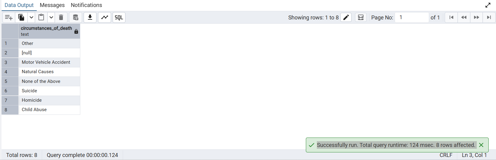

## 5. Gender distribution in the referrels dataset

### Reasoning
This query reveals the gender distribution including missing values which is essential for data quality validation and any analyses that rely on gender.

### Optimization
COUNT(*) is the fastest possible aggregate. GROUP BY gender is the minimal grouping needed.

### SQL Query
```sql
SELECT COALESCE(gender,'UnSpecified') AS gender, count(*)  AS gender_count
FROM public.referrals
group by gender
```
### Results
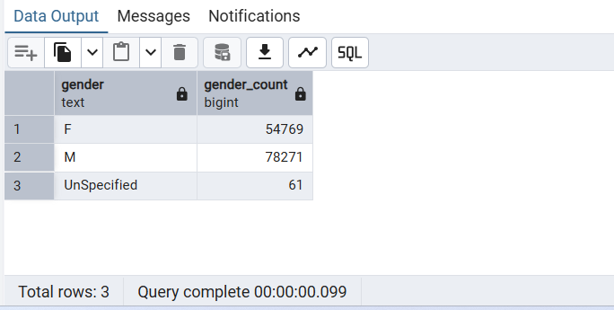

## 6. Race distribution 

### Reasoning
This query reveals the race distribution including missing values which is essential for data quality validation and any analyses that rely on race.

### SQL Query
```sql
SELECT race, count(*) as race_distribution
FROM public.referrals
group by race
```

### Results
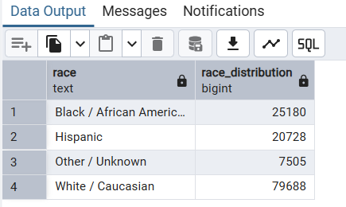

## 7. Cause of death distribution

### Reasoning
This query reveals the cause of death distribution including missing values which is essential for data quality validation and any analyses that rely on cause of death.

### SQL Query
```sql
select COALESCE(cause_of_death_unos,'UnSpecified') AS cause_of_death_unos
,count(*) as cause_of_death_distribution from referrals
group by cause_of_death_unos
order by cause_of_death_distribution DESC
```
### Results
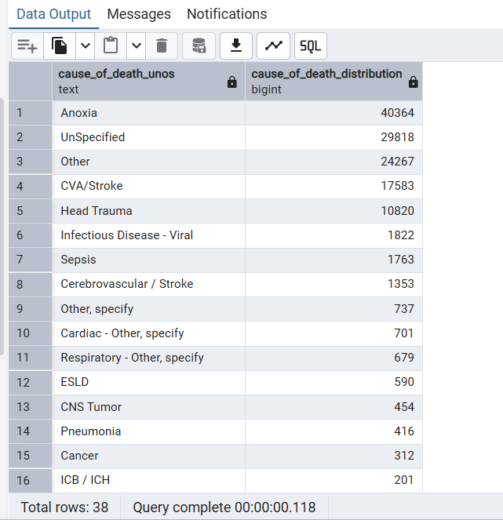

## 8. Referral volumes by OPO and Year

### Reasoning
This query provides a view of how referral activity changes over time for each OPO. By counting referrals by OPO × year, it becomes easy to spot trends such as growth, decline, or sudden shifts in referral volume. 

### SQL Query
```sql
    SELECT opo, referral_year, count(opo) as referral_volume
    FROM referrals
    GROUP BY opo, referral_year
	ORDER BY opo, referral_year
```
### Results
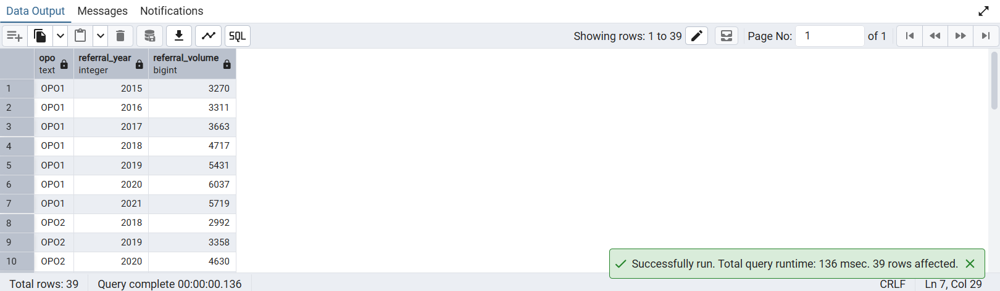

## 9. How many referrals fall into predefined age categories?

### Reasoning  
This query uses predefined age groups (e.g., Under 18, 18–45, 46–60, 61–74, 75+) to show how referrals are distributed across these age groups.

### SQL Query
```sql
SELECT 
    age_group,
    COUNT(*) AS referral_count
FROM referrals
GROUP BY age_group
ORDER BY age_group;
```
### Results
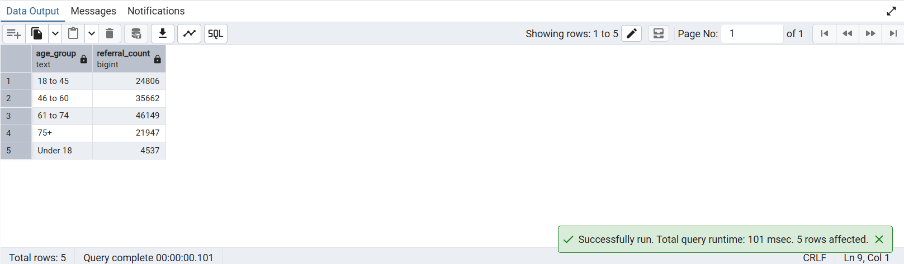

## 10. How is age distributed across the entire population?
### Reasoning
This query divides the population into four equally sized age groups NTILES(4) based on the underlying distribution of age. Instead of relying on predefined age groups, it shows how age is spread across the population and where the “younger” and “older” segments fall in relative terms. 

### SQL Query
```sql
WITH strat AS (
    SELECT
        *,
        NTILE(4) OVER (ORDER BY age) AS age_quartile
    FROM referrals
)
SELECT 
    age_quartile,
    COUNT(*) AS referral_count,
    AVG(age) AS avg_age
FROM strat
GROUP BY age_quartile
ORDER BY age_quartile;
```

### Results
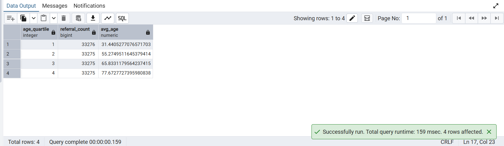

### Insight
The distribution is right‑skewed (older-heavy).

## 11. Analysis of Donation Rate Using Actual Donors and  modeled eligible deaths

### Reasoning
The donation rate compares actual donors to modeled eligible deaths to measure how well an OPO converts potential donors into actual donors. Donation rate uses modeled eligible deaths because they represent the true potential donor pool in the entire OPO service area, not just the referrals that were documented. Actual eligible deaths depend on referral behavior and documentation quality, so they cannot be used as the denominator. The modeled value ensures fair comparisons across OPOs and avoids rewarding under‑referral or poor documentation.

### Optimization
Wrapping the logic in donation_rates_view centralizes the donation‑rate calculation. Any other query  can reuse this logic without duplication.

### SQL Query 

```sql  
DROP VIEW IF EXISTS donation_rates_view;
CREATE VIEW donation_rates_view AS
	WITH donation_rates AS (
	    WITH actual_eligible AS (
		    SELECT 
		        opo,
		        referral_year AS year,
		        COUNT(*) AS actual_eligible_deaths
		    FROM referrals
		    WHERE 
		        age < 75
		        AND ( donor_type IN ('DCD','DBD'))
		    GROUP BY opo, referral_year
		),

		actual_donors AS (
		    SELECT 
		        opo,
		        procured_year AS year,
		        COUNT(*) AS actual_donors
		    FROM referrals
		    WHERE procured = true
		    GROUP BY opo, procured_year
		)

		SELECT
		    c.opo,
		    c.year,
		    c.calc_deaths,
		    c.calc_deaths_lb,
		    c.calc_deaths_ub,
		    ae.actual_eligible_deaths,
		    ad.actual_donors,
		    ad.actual_donors / c.calc_deaths AS donation_rate,
		    ad.actual_donors / c.calc_deaths_lb AS donation_rate_best_case,
		    ad.actual_donors / c.calc_deaths_ub AS donation_rate_worst_case
		FROM calc_deaths c
		LEFT JOIN actual_eligible ae
		    ON c.opo = ae.opo AND c.year = ae.year
		LEFT JOIN actual_donors ad
		    ON c.opo = ad.opo AND c.year = ad.year
		ORDER BY c.opo, c.year
	)
SELECT * FROM DONATION_RATES_VIEW;

```
### Results
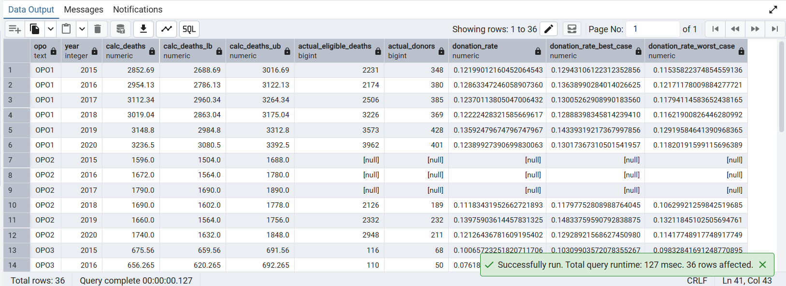


## 12. Ranking OPOs by Donation Rate

### Reasoning
This query ranks OPOs by their donation rate within each year, allowing us to compare performance across organizations during the same time period.

### Optimization
RANK() OVER (PARTITION BY year ORDER BY donation_rate DESC) avoids subqueries and computes ranks in a single pass over the data. Also it uses the donation_rates_view that was computed in the previous query.

### SQL Query
```sql
SELECT
    opo,
    year,
    donation_rate,
    RANK() OVER (PARTITION BY year ORDER BY donation_rate DESC) AS performance_rank
FROM donation_rates_view
WHERE donation_rate IS NOT NULL
ORDER BY year, performance_rank;
```

### Results
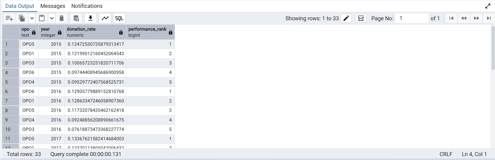

## 13. Full operational‑pipeline profile for every OPO and year

### Reasoning
This query shows how referrals move through each stage of the donation process: approach, authorization, procurement, and transplantation.Because the pipeline is sequential, each rate answers a different operational question—approach rate reflects hospital engagement, authorization rate reflects family consent effectiveness, procurement rate reflects clinical suitability and OR coordination, and transplant rate reflects placement and utilization. The final overall pipeline rate summarizes the entire process into a single, interpretable metric. 

### Optimization
Using SUM(CASE WHEN … THEN 1 END) is an efficient pattern for counting stage completions. It avoids subqueries.

### SQL Query
```sql
SELECT 
    opo,
    referral_year,

    -- Stage counts
    SUM(CASE WHEN approached = TRUE THEN 1 ELSE 0 END) AS approached_count,
    SUM(CASE WHEN authorized = TRUE THEN 1 ELSE 0 END) AS authorized_count,
    SUM(CASE WHEN procured = TRUE THEN 1 ELSE 0 END) AS procured_count,
    SUM(CASE WHEN transplanted = TRUE THEN 1 ELSE 0 END) AS transplanted_count,

    COUNT(*) AS total_referrals,

    -- Stage conversion rates
    SUM(CASE WHEN approached = TRUE THEN 1 ELSE 0 END)::decimal 
        / COUNT(*) AS approach_rate,

    SUM(CASE WHEN authorized = TRUE THEN 1 ELSE 0 END)::decimal 
        / NULLIF(SUM(CASE WHEN approached = TRUE THEN 1 ELSE 0 END), 0) AS authorization_rate,

    SUM(CASE WHEN procured = TRUE THEN 1 ELSE 0 END)::decimal 
        / NULLIF(SUM(CASE WHEN authorized = TRUE THEN 1 ELSE 0 END), 0) AS procurement_rate,

    SUM(CASE WHEN transplanted = TRUE THEN 1 ELSE 0 END)::decimal 
        / NULLIF(SUM(CASE WHEN procured = TRUE THEN 1 ELSE 0 END), 0) AS transplant_rate,

    -- Overall pipeline conversion score
    SUM(CASE WHEN transplanted = TRUE THEN 1 ELSE 0 END)::decimal 
        / COUNT(*) AS overall_pipeline_rate

FROM referrals
GROUP BY opo, referral_year
ORDER BY opo, referral_year;

```

### Results
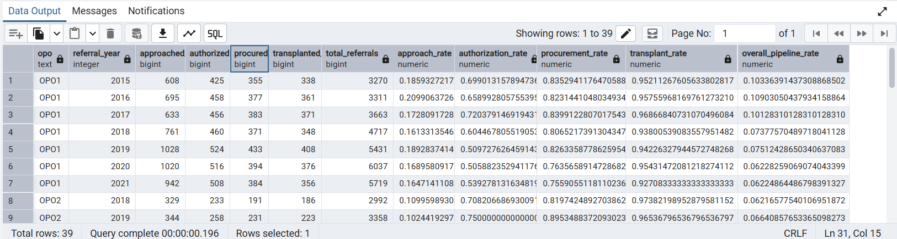


## 14. Year‑over‑Year Donation Rate Trends

### Reasoning
This yoy trend view is essential because donation rate alone shows only a single year’s performance; YoY trends reveal whether an OPO is consistently improving, fluctuating, or experiencing sustained decline.

### Optimization
LAG() computes the previous year’s donation rate without self‑joins or subqueries, making the YoY calculation fast and scalable.

### SQL Query
```sql
SELECT
    opo,
    year,
    donation_rate,
    donation_rate 
        - LAG(donation_rate) OVER (PARTITION BY opo ORDER BY year) 
        AS yoy_change,

    CASE 
        WHEN LAG(donation_rate) OVER (PARTITION BY opo ORDER BY year) IS NULL 
            THEN 'no_prior_year'
        WHEN ABS(donation_rate 
                 - LAG(donation_rate) OVER (PARTITION BY opo ORDER BY year)) < 0.002
            THEN 'stable'
        WHEN donation_rate 
                 - LAG(donation_rate) OVER (PARTITION BY opo ORDER BY year) > 0
            THEN 'improving'
        ELSE 'declining'
    END AS trend_label

FROM donation_rates_view
ORDER BY opo, year;
```

### Results
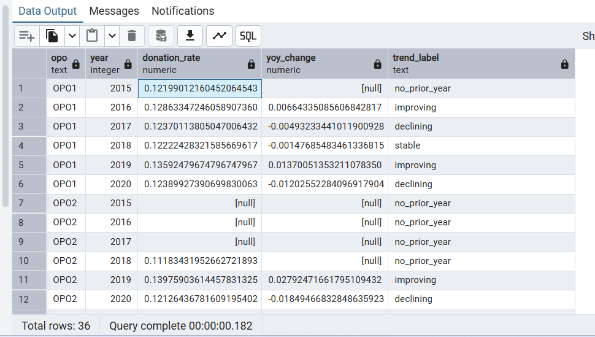

## 15. Referral volume by day of week 

### Reasoning
This query identifies how referral activity varies across the days of the week, revealing operational patterns that remain meaningful even in a date‑shifted dataset.These patterns are important for understanding staffing needs and anticipating workload fluctuations.

### SQL Query
```sql
SELECT
    referral_dayofweek,
    COUNT(*) AS referral_volume
FROM referrals
GROUP BY referral_dayofweek
ORDER BY referral_volume DESC;
```
### Results
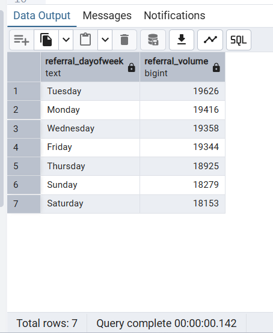

## 16. Donor workflow timing

### Reasoning
This query standardizes all donor‑workflow timestamps and computes the key operational intervals needed to analyze referral‑to‑procurement efficiency.

### Optimization
Filtering early (WHERE time_procured IS NOT NULL) before computing intervals avoids unnecessary calculations and ensures all intervals are valid.

### SQL Query
```sql

DROP VIEW IF EXISTS donor_timings_view;
CREATE VIEW donor_timings_view AS
WITH base AS (
    SELECT
        opo,
        patientid,
        CAST(time_asystole AS timestamp)      AS ts_asystole,
        CAST(time_brain_death AS timestamp)   AS ts_brain_death,
        CAST(time_referred AS timestamp)      AS ts_referred,
        CAST(time_approached AS timestamp)    AS ts_approached,
        CAST(time_authorized AS timestamp)    AS ts_authorized,
        CAST(time_procured AS timestamp)      AS ts_procured,       
		donor_type
    FROM referrals
	WHERE time_procured is not null
),

timing AS (
    SELECT
        opo,
		patientId,
        donor_type,
        EXTRACT(EPOCH FROM (ts_approached - ts_referred)) / 3600 AS hrs_referral_to_approach,
        EXTRACT(EPOCH FROM (ts_authorized - ts_approached)) / 3600 AS hrs_approach_to_authorization,
        EXTRACT(EPOCH FROM (ts_procured - ts_authorized)) / 3600 AS hrs_authorization_to_procurement,
        EXTRACT(EPOCH FROM (ts_procured - ts_brain_death)) / 3600 AS hrs_brain_death_to_procurement,
        EXTRACT(EPOCH FROM (ts_procured - ts_asystole)) / 3600 AS hrs_asystole_to_procurement
    FROM base   
)
SELECT * FROM timing 
ORDER BY opo, patientid;

SELECT * FROM DONOR_TIMINGS_VIEW;
```

### Results
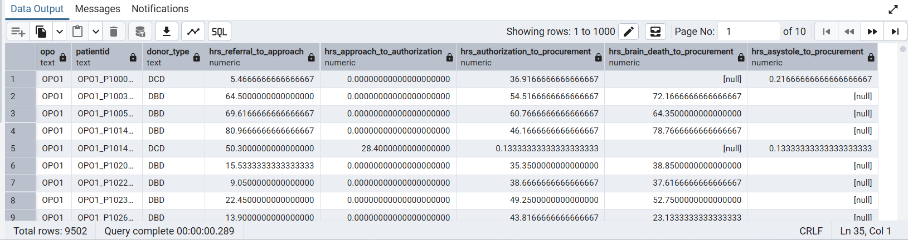

## 17. Median Operational Timing Intervals for donors By opo.

### Reasoning
This query summarizes each OPO’s operational efficiency by calculating the median duration of every major donor‑workflow interval. Medians are used because timing data is highly skewed. 

## Optimization
The donor_timings_view created in the previous query is used here, which simplifies calculations.

### SQL Query
```sql
SELECT
    opo,
    percentile_cont(0.5) WITHIN GROUP (ORDER BY hrs_referral_to_approach) AS median_referral_to_approach,
    percentile_cont(0.5) WITHIN GROUP (ORDER BY hrs_approach_to_authorization) AS median_approach_to_authorization,
    percentile_cont(0.5) WITHIN GROUP (ORDER BY hrs_authorization_to_procurement) AS median_authorization_to_procurement,
    percentile_cont(0.5) WITHIN GROUP (ORDER BY hrs_brain_death_to_procurement) AS median_brain_death_to_procurement,
    percentile_cont(0.5) WITHIN GROUP (ORDER BY hrs_asystole_to_procurement) AS median_asystole_to_procurement
FROM donor_timings_view
GROUP BY opo
ORDER BY opo;
```

### Results
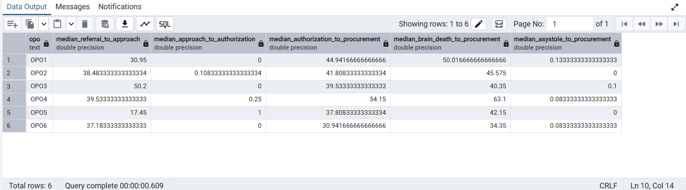

### Insights
Asystole‑to‑procurement intervals are near‑zero for all OPOs, showing how quickly DCD donors must be taken to organ donation after circulatory arrest.

## 18. Indexing Donation Rates to see growth over time

### Reasoning
This query expresses each OPO’s donation rate relative to its first available year.This allows us to measure growth over time on a normalized scale. The baseline year is converted to an index of 100 and all subsequent years show percentage change rather than raw rate differences, making trends easier to compare across OPOs.

### Optimization
The baseline CTE identifies each OPO’s earliest non‑NULL donation‑rate year, avoiding repeated MIN() calculations in the main query.

### SQL Query
```sql
WITH baseline AS (
    SELECT
        opo,
        MIN(year) AS baseline_year
    FROM donation_rates_view
    WHERE donation_rate IS NOT NULL
    GROUP BY opo
),
base AS (
    SELECT
        d.opo,
        d.year,
        d.donation_rate,
        b.baseline_year,
        b0.donation_rate AS baseline_rate
    FROM donation_rates_view d
    JOIN baseline b
      ON d.opo = b.opo
    JOIN donation_rates_view b0
      ON b0.opo = b.opo
     AND b0.year = b.baseline_year
)

SELECT
    opo,
    year,
    donation_rate,
    (donation_rate / baseline_rate) * 100 AS indexed_donation_rate
FROM base
ORDER BY opo, year;
```
### Results
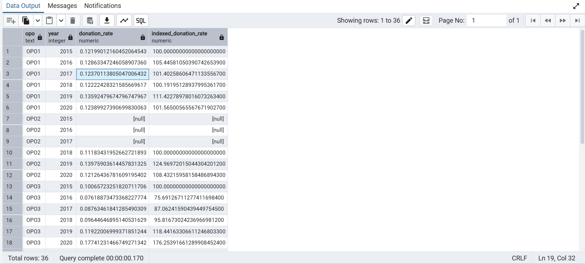

### Insights
Indexed donation rates show that OPO3 experienced the strongest improvement over the dataset period, rising from baseline (100) to 176 by 2020—a 76% relative increase.

## 19. Rolling 3‑Year Donation Rate Trends to Assess OPO Performance Stability

### Reasoning
This query smooths year‑to‑year fluctuations in donation rates by calculating a rolling 3‑year average for each OPO.  Because donation rates can swing sharply due to small denominators, unusual clinical years, or operational variability, the rolling window highlights the underlying performance trend rather than isolated spikes.

### Optimization
AVG() OVER (...) computes the rolling average without self‑joins or subqueries, making the query fast and scalable.

### SQL Query
```sql
SELECT
    opo,
    year,
    donation_rate,
    AVG(donation_rate) OVER (
        PARTITION BY opo
        ORDER BY year
        ROWS BETWEEN 2 PRECEDING AND CURRENT ROW
    ) AS rolling_3yr_donation_rate
FROM donation_rates_view
ORDER BY opo, year;

```
### Results
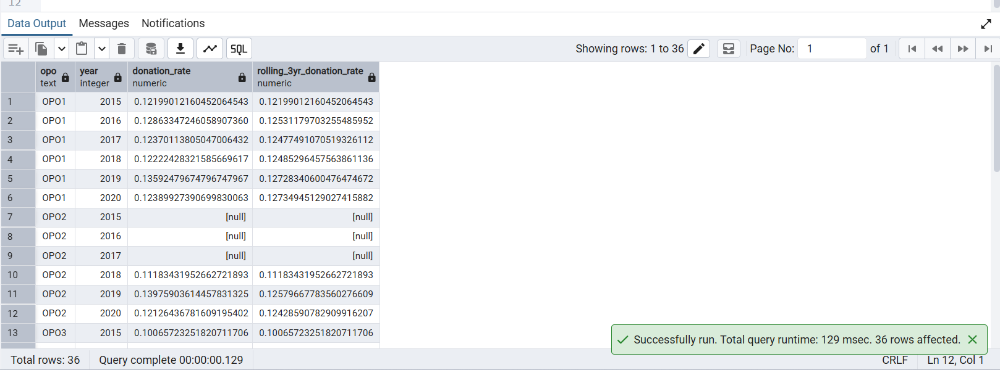

### Insights
A 3‑year rolling average of donation rates shows that OPO3’s improvement is not a one‑year anomaly but a sustained upward trend across the dataset period. 

## 20. Cohort Analysis of Referral‑Year Groups

### Reasoning
This query groups referrals into cohorts based on the year they entered the system, allowing us to track how each referral‑year group moves through the donation pipeline.  By calculating approach, authorization, and conversion rates for each cohort, we can see whether newer cohorts perform better than older ones and identify long‑term operational trends. 

### Optimization
The cohorts CTE computes all counts once per OPO‑year, reducing repeated logic and making the final SELECT lightweight.

### SQL Query
```sql
WITH cohorts AS (
    SELECT
        opo,
        referral_year,
        COUNT(*) AS total_referrals,
        SUM(CASE WHEN approached is true THEN 1 ELSE 0 END) AS approached_count,
        SUM(CASE WHEN authorized is true THEN 1 ELSE 0 END) AS authorized_count,
        SUM(CASE WHEN procured is true THEN 1 ELSE 0 END) AS donor_count
    FROM referrals
    GROUP BY opo, referral_year
)

SELECT
    opo,
    referral_year AS cohort_year,
    total_referrals,
    approached_count,
    authorized_count,
    donor_count,
    approached_count::float / total_referrals AS approach_rate,
    authorized_count::float / total_referrals AS authorization_rate,
    donor_count::float / total_referrals AS conversion_rate
FROM cohorts
ORDER BY opo, cohort_year;
```

### Results
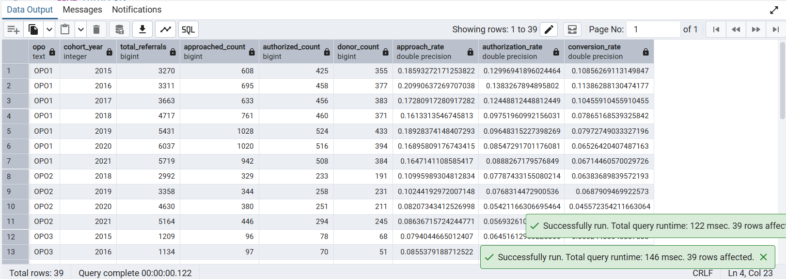

## 21. Data‑Quality and Anomaly Detection in Referral Records

### Reasoning
This query checks whether key timestamps in the referral workflow follow a logical order and flags records where the sequence is impossible or inconsistent. These anomalies usually indicate documentation errors or missing data, so identifying them helps improve data quality before running operational or timing‑based analyses.

### Optimization
All anomaly checks are performed in one SELECT statement using a CASE expression. This avoids multiple scans or subqueries and keeps the logic centralized and easy to maintain.

### SQL Query
```sql
SELECT
    opo,
    patientid,
    referral_year,
    time_referred,
    time_approached,
    time_authorized,
    time_procured,
    time_brain_death,
    time_asystole,

    CASE 
        WHEN time_brain_death IS NULL AND brain_death = TRUE 
            THEN 'brain_death flag true but missing timestamp'
        WHEN CAST(time_approached AS timestamp) < CAST(time_referred AS timestamp)
            THEN 'approach before referral'
        WHEN CAST(time_authorized AS timestamp) < CAST(time_approached AS timestamp)
            THEN 'authorization before approach'
        WHEN CAST(time_procured AS timestamp) < CAST(time_authorized AS timestamp)
            THEN 'procurement before authorization'
        WHEN CAST(time_brain_death AS timestamp) > CAST(time_procured AS timestamp) 
            THEN 'brain death after procurement'
        WHEN CAST(time_asystole AS timestamp) > CAST(time_procured AS timestamp)
            THEN 'asystole after procurement'
        WHEN time_procured IS NOT NULL AND authorized = FALSE 
            THEN 'procured but not authorized'
        ELSE 'unknown'
    END AS anomaly_type

FROM referrals
WHERE
    (brain_death = TRUE AND time_brain_death IS NULL)
    OR (time_approached IS NOT NULL AND time_referred IS NOT NULL AND CAST(time_approached AS timestamp) < CAST(time_referred AS timestamp)) 
    OR (time_authorized IS NOT NULL AND time_approached IS NOT NULL AND CAST(time_authorized AS timestamp) < CAST(time_approached AS timestamp))
    OR (time_procured IS NOT NULL AND time_authorized IS NOT NULL AND CAST(time_procured AS timestamp) < CAST(time_authorized AS timestamp))
    OR (time_brain_death IS NOT NULL AND time_procured IS NOT NULL AND CAST(time_brain_death AS timestamp) > CAST(time_procured AS timestamp))
    OR (time_asystole IS NOT NULL AND time_procured IS NOT NULL AND CAST(time_asystole AS timestamp) > CAST(time_procured AS timestamp))
    OR (procured = TRUE AND authorized = FALSE);
```
### Results
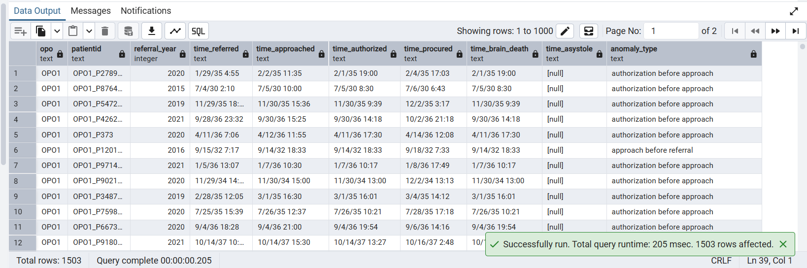

## 22. Conversion rate comparison for brain_death (DBD) and asystole (DCD)

### Reasoning
This query highlights the conversion rate comparison for DBD and DCD. 

### SQL Query
```sql
SELECT
    donor_type,
    COUNT(*) AS total_referrals,
    SUM(approached::int) AS approached_count,
    SUM(authorized::int) AS authorized_count,
    SUM(procured::int) AS procured_count,
    SUM(transplanted::int) AS transplanted_count,
    SUM(approached::int)::float / COUNT(*) AS approach_rate,
    SUM(authorized::int)::float / COUNT(*) AS authorization_rate,
    SUM(procured::int)::float / COUNT(*) AS procurement_rate,
    SUM(transplanted::int)::float / COUNT(*) AS transplant_rate
FROM referrals
WHERE donor_type IN ('DBD','DCD')
GROUP BY donor_type;
```
### Results
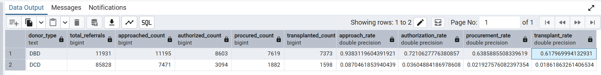

### Insights
DBD donors have higher approach, authorization, procurement, and transplant rates. DCD donors often face time‑sensitive physiology and more variable hospital practices, which reduces conversion at multiple stages.

## 23. Organs procured but not transplanted

### Reasoning
This query exposes lost transplant opportunities, enabling deeper investigation into why recovered organs were not used.

### SQL Query
```sql
SELECT
    patientid,
    opo,
    brain_death,
    time_asystole,
    time_brain_death,
    outcome_heart,
    outcome_liver,
    outcome_kidney_left,
    outcome_kidney_right,
    outcome_lung_left,
    outcome_lung_right,
    outcome_intestine,
    outcome_pancreas
FROM referrals
WHERE procured = TRUE
  AND transplanted = FALSE;
```
### Results
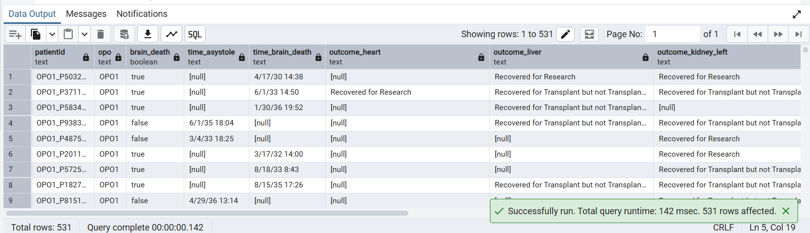

## 24. Donors that had at least one organ recovered but no organs transplanted, and how many such cases occurred per OPO

### Reasoning
This query highlights donors whose organs were recovered but never transplanted, exposing OPO‑level operational issues.

### Optimization
The query is simple and straight forward since we already have the fields is_recovered_any and is_transplanted_any as part of our ETL.

### SQL Query
```sql
SELECT
    opo,
    COUNT(*) AS recovered_but_zero_tx
FROM referrals
WHERE COALESCE(is_recovered_any, FALSE)
  AND NOT COALESCE(is_transplanted_any, FALSE)
GROUP BY opo
ORDER BY recovered_but_zero_tx DESC;


```
### Results
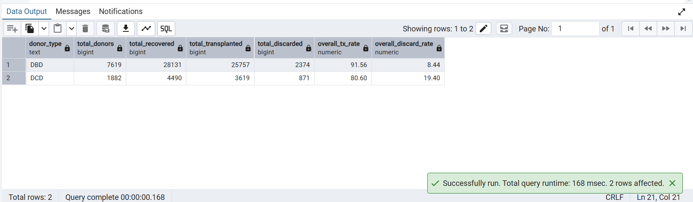

## 25. Organ Utilization and Performance Ranking by Any Grouping Category

### Reasoning
This query provides a standardized way to evaluate organ‑utilization performance across any category, making it easy to compare hospitals, OPOs, age groups, or donor types using the same consistent metrics.

### Optimization
Instead of writing separate queries for organ utilization (by hospital, by OPO, by age_group, by donor_type), the function lets us analyze utilization across any grouping column simply by passing a parameter. This dramatically reduces code duplication.

### SQL Query
```sql
CREATE OR REPLACE FUNCTION organ_utilization_by(dim text)
RETURNS TABLE (
    category text,
    total_donors bigint,
    total_recovered_organs bigint,
    total_transplanted_organs bigint,
    total_discarded_organs bigint,
    utilization_rate float,
    utilization_percentile float,
    utilization_tier text
) AS $$
BEGIN
    RETURN QUERY EXECUTE format(
        $f$
        WITH base AS (
            SELECT
                %1$I AS category,
                COUNT(*) FILTER (WHERE procured = TRUE) AS total_donors,
                SUM(total_recovered_organs) AS total_recovered_organs,
                SUM(total_transplanted_organs) AS total_transplanted_organs,
                SUM(total_discarded_organs) AS total_discarded_organs
            FROM referrals
            WHERE donor_type IN ('DBD','DCD')
            GROUP BY %1$I
            HAVING SUM(total_recovered_organs) > 0
        )
        SELECT
            COALESCE(category,'Unknown') AS category,
            total_donors,
            total_recovered_organs,
            total_transplanted_organs,
            total_discarded_organs,
            total_transplanted_organs::float / NULLIF(total_recovered_organs,0) AS utilization_rate,
            CUME_DIST() OVER (
                ORDER BY total_transplanted_organs::float / NULLIF(total_recovered_organs,0)
            ) AS utilization_percentile,
            CASE
                WHEN CUME_DIST() OVER (
                        ORDER BY total_transplanted_organs::float / NULLIF(total_recovered_organs,0)
                     ) >= 0.90 THEN 'Top 10%%'
                WHEN CUME_DIST() OVER (
                        ORDER BY total_transplanted_organs::float / NULLIF(total_recovered_organs,0)
                     ) >= 0.75 THEN 'Top 25%%'
                WHEN CUME_DIST() OVER (
                        ORDER BY total_transplanted_organs::float / NULLIF(total_recovered_organs,0)
                     ) >= 0.25 THEN 'Middle 50%%'
                WHEN CUME_DIST() OVER (
                        ORDER BY total_transplanted_organs::float / NULLIF(total_recovered_organs,0)
                     ) >= 0.10 THEN 'Bottom 25%%'
                ELSE 'Bottom 10%%'
            END AS utilization_tier
        FROM base
        ORDER BY category
        $f$
        , dim
    );
END;
$$ LANGUAGE plpgsql;
```
#### a. Organ utilization by donor type (DBD/DCD)
##### SQL Query
```sql
SELECT * FROM organ_utilization_by('donor_type');
```

##### Results
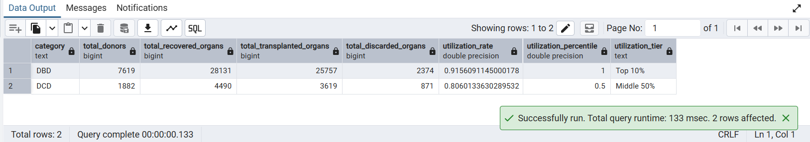

#### b. Organ utilization by age
##### SQL Query
```sql
SELECT * FROM organ_utilization_by('age_group');
```
##### Results
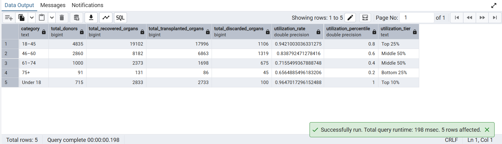

#### c. Organ utilization by opo
##### SQL Query
```sql
SELECT * FROM organ_utilization_by('opo');
```

##### Results
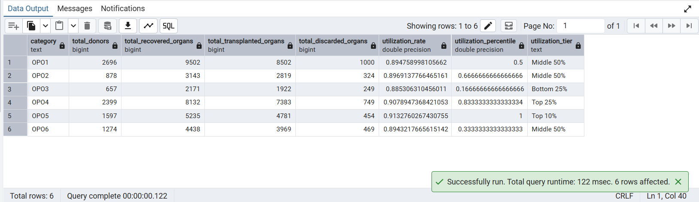

#### d. Organ utilization by cause of death unos
##### SQL Query
``` sql
SELECT * FROM organ_utilization_by('cause_of_death_unos');
```
##### Results
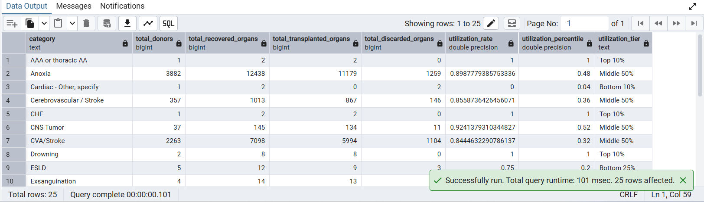

#### e. Organ Utilization by hospital
##### SQL Query
```sql
SELECT * FROM organ_utilization_by('hospitalid');
```

##### Results
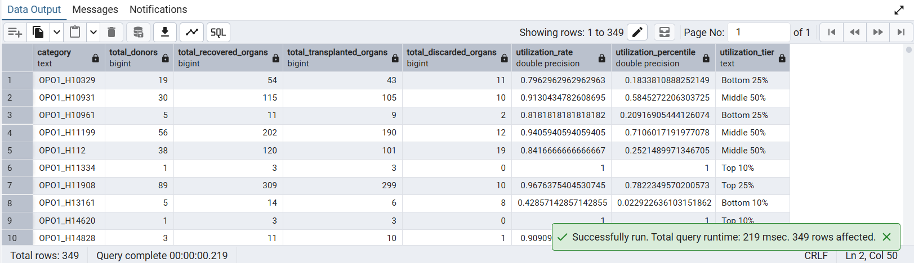

#### f.Organ utilization by race
##### SQL Query
```sql
SELECT * FROM organ_utilization_by('race');
```
##### Results
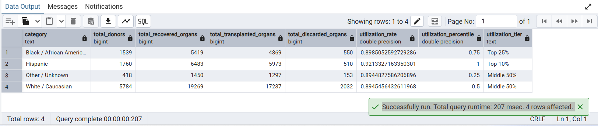

#### g. Organ utilization by gender
##### SQL Query
```sql
SELECT * FROM organ_utilization_by('gender');
```
##### Results
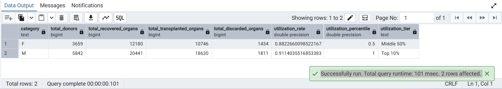

#### h. Organ utilization by blood type
##### SQL Query
```sql
SELECT * FROM organ_utilization_by('abo_bloodtype');
```
##### Results
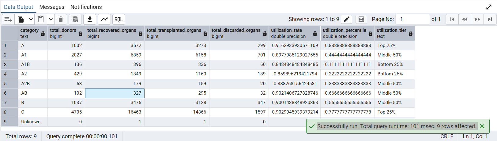

#### i. Organ utilization by abo_rh
##### SQL Query
```sql
SELECT * FROM organ_utilization_by('abo_rh');
```
##### Results
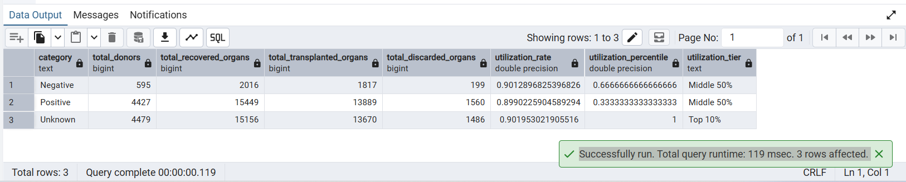

#### j. Organ utilization by mechanism of death
##### SQL Query
```sql
SELECT * FROM organ_utilization_by('mechanism_of_death');
```

##### Results
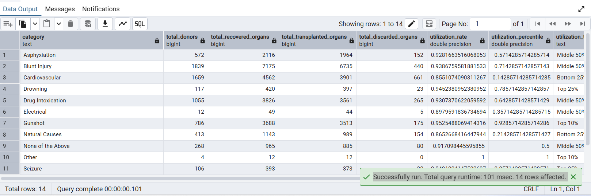

#### k. Organ utilization by circumstances of death
##### SQL Query
```sql
SELECT * FROM organ_utilization_by('circumstances_of_death');
```

##### Results
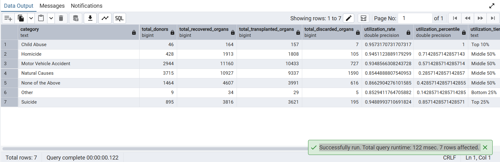


## 26. For each age_group, how many donors are DBD vs DCD side‑by‑side in columns : age_group | DBD_donors | DCD_donors |

### Reasoning
This query provides a clear side‑by‑side comparison of DBD and DCD donor counts within each age_group. Presenting both donor types in columns supports faster interpretation and is ideal for dashboards and summaries.

### Optimization
This query uses a crosstab pivot, which is more efficient than running multiple separate COUNT queries or joining subqueries for each donor type. By aggregating once and pivoting the results, it reduces redundant scans of the referrals table and produces a compact, analysis‑ready dataset.

### SQL Query
```sql
CREATE EXTENSION IF NOT EXISTS tablefunc;

SELECT *
FROM crosstab(
    $$
    SELECT
        age_group,
        donor_type,
        COUNT(*) AS donor_count
    FROM referrals
    WHERE donor_type IN ('DBD','DCD')
    GROUP BY age_group, donor_type
    ORDER BY age_group, donor_type
    $$,
    $$
    SELECT unnest(ARRAY['DBD','DCD'])
    $$
) AS ct(
    age_group text,
    dbd_donors int,
    dcd_donors int
);
```

### Results
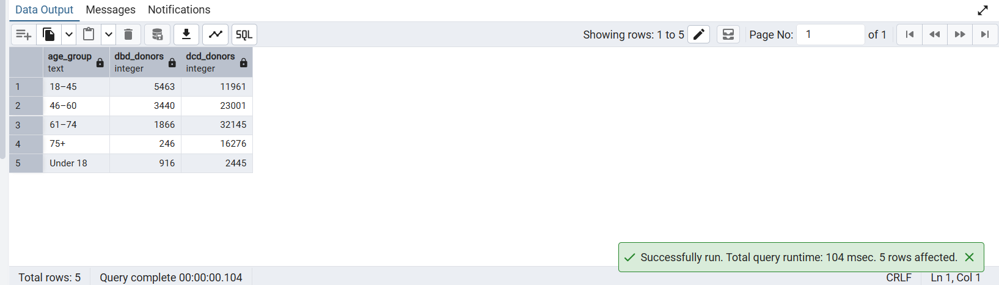

## 27. Donor Funnel Analysis Across OPOs using Recursive CTE

### Reasoning
This query transforms raw referral outcomes into a structured, stage‑by‑stage donor funnel for each OPO, making it easy to see where potential donors are lost across the pipeline.

### Optimization
A recursive CTE is used because the donor funnel is a step by step sequence — each stage depends on the previous one (referrals → approached → authorized → recovered → transplanted). The recursive CTE generates these stages in order without manually writing multiple UNION blocks.

### SQL Query
```sql
WITH RECURSIVE base AS (
    SELECT
        opo,
        COUNT(*) AS referrals,
        COUNT(CASE WHEN approached = true THEN 1 END) AS approached,
        COUNT(CASE WHEN authorized = true THEN 1 END) AS authorized,
        COUNT(CASE WHEN is_recovered_any = true THEN 1 END) AS recovered,
        COUNT(CASE WHEN is_transplanted_any = true THEN 1 END) AS transplanted
    FROM referrals
    GROUP BY opo
),

 funnel AS (
    -- Stage 1 (anchor)
    SELECT
        opo,
        1 AS stage,
        referrals AS count
    FROM base

    UNION ALL

    -- Stages 2–5 (recursive)
    SELECT
        f.opo,
        f.stage + 1,
        CASE f.stage + 1
            WHEN 2 THEN b.approached
            WHEN 3 THEN b.authorized
            WHEN 4 THEN b.recovered
            WHEN 5 THEN b.transplanted
        END AS count
    FROM funnel f
    JOIN base b ON f.opo = b.opo
    WHERE f.stage < 5
)

SELECT *
FROM funnel
ORDER BY opo, stage;

```

### Results
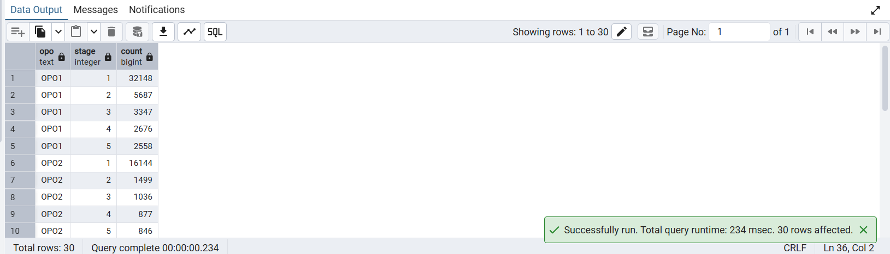

## 28. Tissue and Eye Referral Performance by Any Grouping Category

### Reasoning
This query provides a flexible way to analyze tissue and eye referral patterns across any category—such as hospital, OPO, age group, cause of death, or donor type. 

### Optimization
Instead of writing separate queries for tissue and eye referral performance (by hospital, by OPO, by age_group, by donor_type), the function lets us analyze the tissue and eye referral rate across any grouping column simply by passing a parameter. This dramatically reduces code duplication.

### SQL Query
``` sql
CREATE OR REPLACE FUNCTION tissue_eye_by(dim text)
RETURNS TABLE (
    category text,
    total_referrals bigint,
    tissue_yes bigint,
    tissue_no bigint,
    eye_yes bigint,
    eye_no bigint,
    tissue_rate float,
    eye_rate float
) AS $$
BEGIN
    RETURN QUERY EXECUTE format(
        $f$
        SELECT
            COALESCE(%1$I, 'Unknown') AS category,
            COUNT(*) AS total_referrals,
            SUM(tissue_referral::int) AS tissue_yes,
            SUM((NOT tissue_referral)::int) AS tissue_no,
            SUM(eye_referral::int) AS eye_yes,
            SUM((NOT eye_referral)::int) AS eye_no,
            AVG(tissue_referral::int)::float AS tissue_rate,
            AVG(eye_referral::int)::float AS eye_rate
        FROM referrals
        GROUP BY %1$I
        ORDER BY category
        $f$
        , dim
    );
END;
$$ LANGUAGE plpgsql;
```

#### a. Tissue and eye referral perfomance by donor type
##### SQL Query
```sql
SELECT * FROM tissue_eye_by('donor_type');
```

##### Results
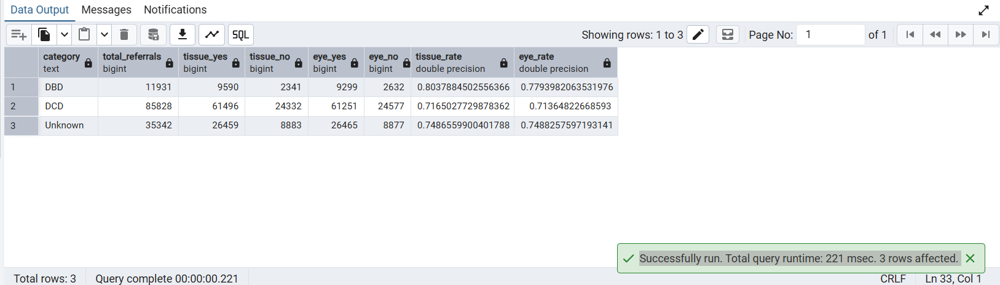

#### b. Tissue and eye referral perfomance by age
##### SQL Query
```sql
SELECT * FROM tissue_eye_by('age_group');
```

##### Results
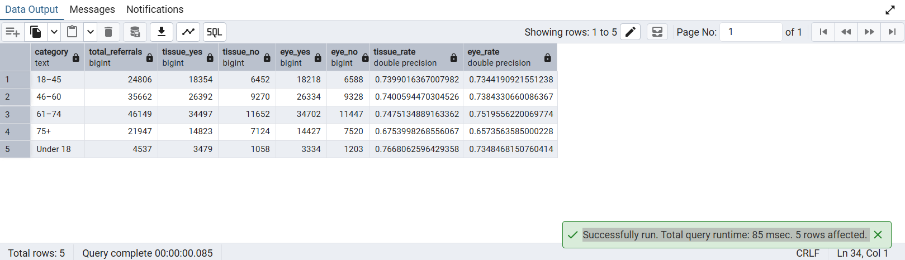

#### c. Tissue and eye referral perfomance by opo
##### SQL Query
```sql
SELECT * FROM tissue_eye_by('opo');
```

##### Results
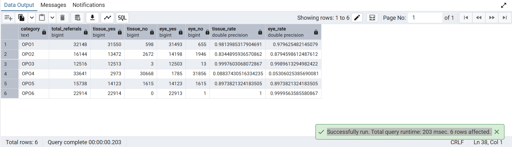

##### Insights
Most OPOs show very high tissue and eye referral success, but OPO4 is a clear outlier with extremely low rates, indicating major operational or partnership barriers.

#### d. Tissue and eye referral perfomance by hospital
##### SQL Query
```sql
SELECT * FROM tissue_eye_by('hospitalid');
```

##### Results
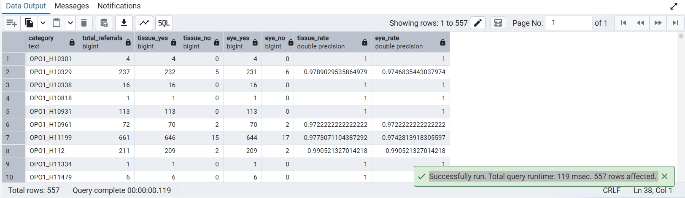

#### e. Tissue and eye referral perfomance by cause_of_death_unos
##### SQL Query
```sql
SELECT * FROM tissue_eye_by('cause_of_death_unos');
```

##### Results
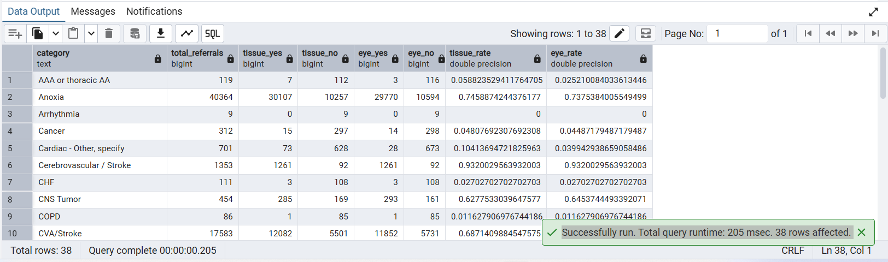

#### f. Tissue and eye referral perfomance by mechanism of death
##### SQL Query
```sql
SELECT * FROM tissue_eye_by('mechanism_of_death');
```

##### Results
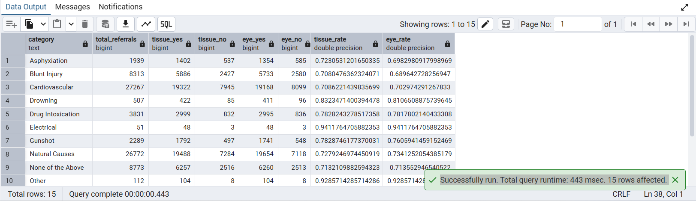

#### g. Tissue and eye referral perfomance by circumstances of death
##### SQL Query
```sql
SELECT * FROM tissue_eye_by('circumstances_of_death');
```

##### Results
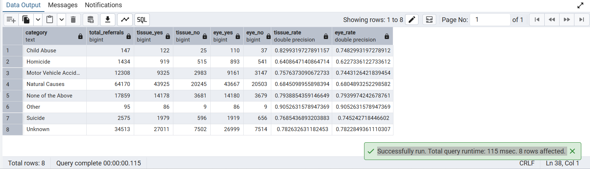

#### h. Tissue and eye referral perfomance by gender
##### SQL Query
```sql
SELECT * FROM tissue_eye_by('gender');
```

##### Results
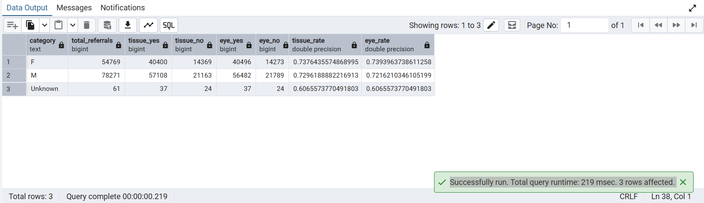

#### i. Tissue and eye referral perfomance by race
##### SQL Query
```sql
SELECT * FROM tissue_eye_by('race');
```

##### Results
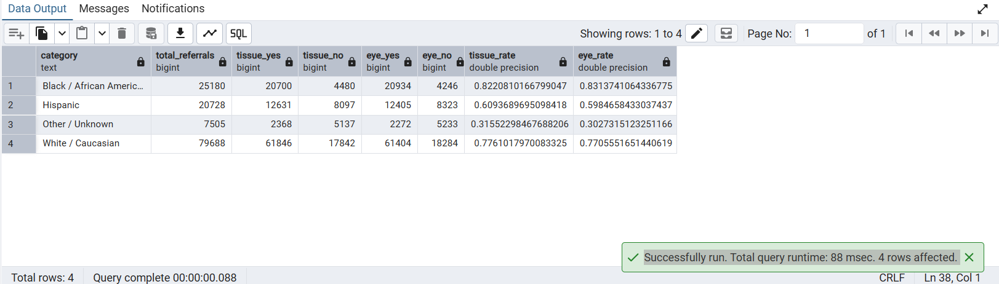

#### j. Tissue and eye referral perfomance by blood type
##### SQL Query
```sql
SELECT * FROM tissue_eye_by('abo_bloodtype');
```

##### Results
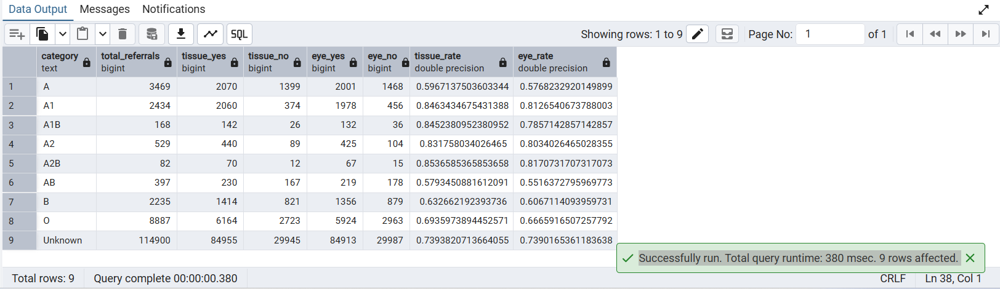

#### k. Tissue and eye referral perfomance by abo_rh
##### SQL Query
```sql
SELECT * FROM tissue_eye_by('abo_rh');
```

##### Results
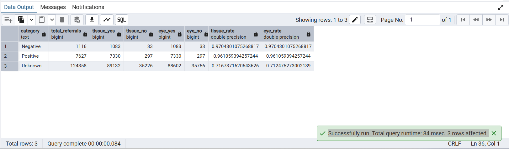


